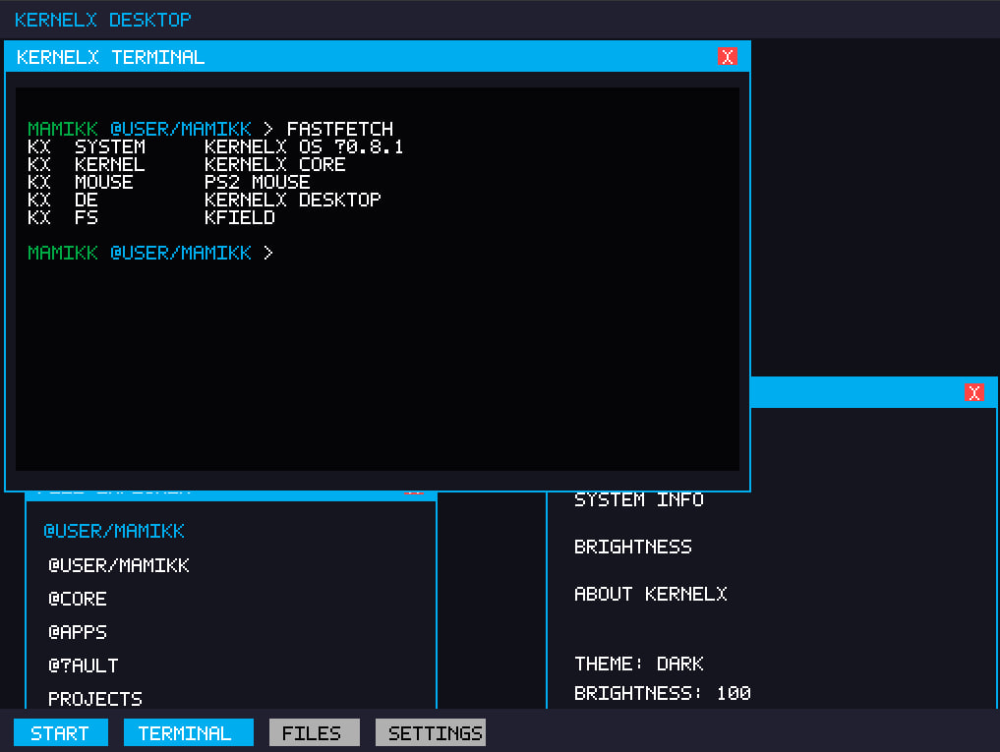
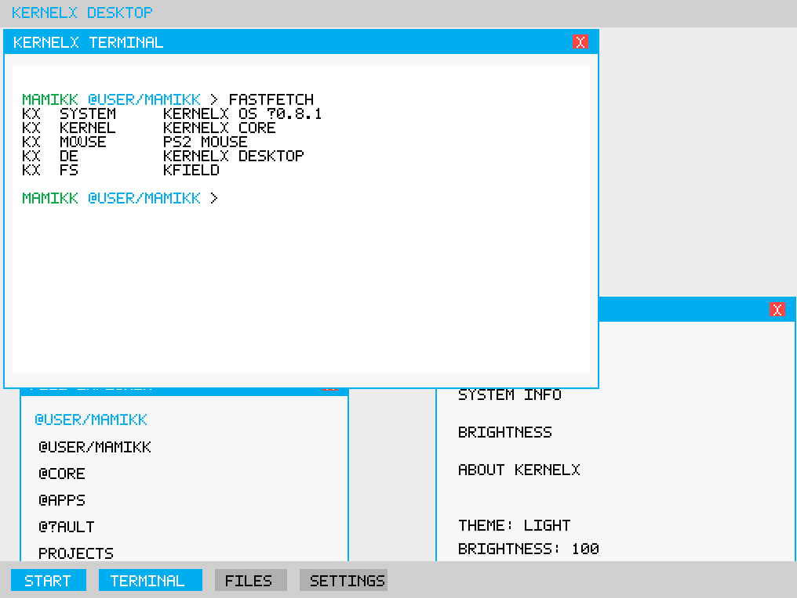
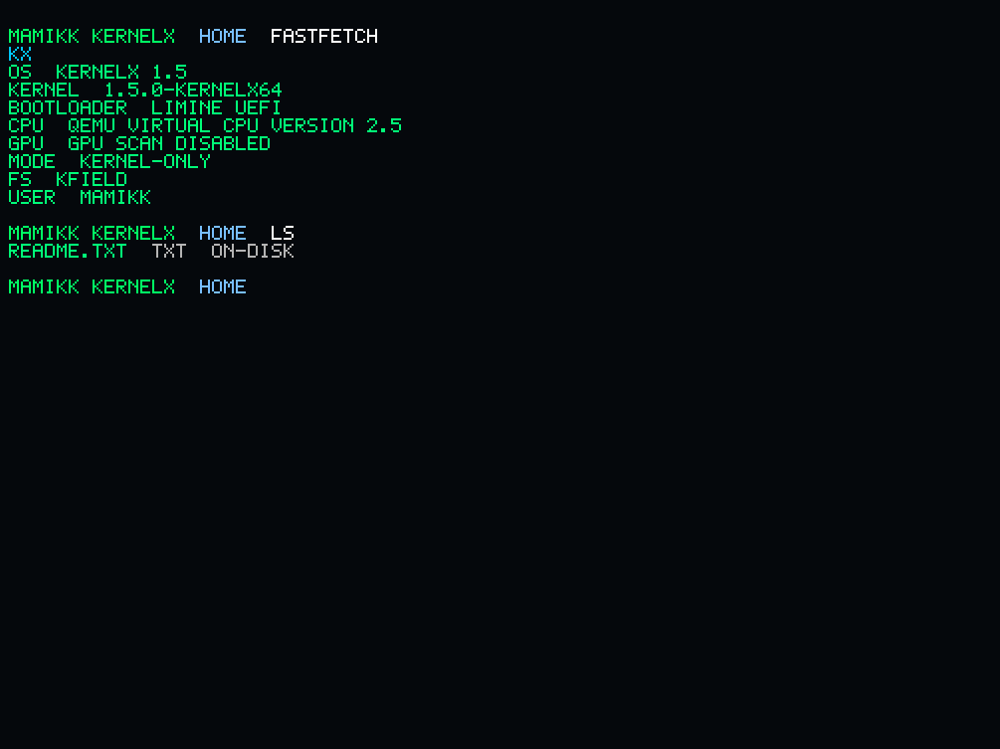

🚀 KernelX OS

KernelX OS is an experimental operating system built from scratch by
Mamik Kosyntsev (13 y/o developer).

The project focuses on simplicity, control, and understanding how operating systems work at a low level.

🧠 Architecture
x86_64 (64-bit)
GRUB Multiboot boot
Custom kernel
Framebuffer graphics

KernelX runs on a fully custom kernel designed for modern x86_64 systems.

⚠️ Current State

KernelX is under active development.

The system currently runs in a framebuffer terminal
GUI/Desktop environment is in development
Many subsystems are still being improved

👉 The current stable build is KernelX v1.5

✨ Features
Custom 64-bit kernel
GRUB Multiboot ISO boot
Framebuffer graphics output
PS/2 keyboard input
Login system (username/password)
Terminal (kxsh)
Built-in commands (help, fastfetch, etc.)
KField virtual filesystem
FAT32 read/write support
Early PCI / USB (XHCI) detection
📸 Screenshots

### Dark Theme (legacy GUI preview v8.1.0)

### Light Theme (legacy GUI preview v8.1.0)

### KernelX (v1.5)

▶️ Run (QEMU)
qemu-system-x86_64 \
  -cdrom KernelX.iso \
  -boot d \
  -drive if=ide,index=0,format=raw,file=KernelX-release.img
📦 Repository Contents
kernel/                → kernel source code
iso/                   → ISO build files
KernelX.iso            → bootable image
KernelX-release.img    → clean FAT32 disk image
🧩 Components
KernelX → custom kernel
KField → virtual filesystem
kxsh → terminal shell
⚡ Why KernelX
Minimal design (no unnecessary layers)
Full control over the system
Built completely from scratch
Learning-focused OS development
Clean architecture
🔮 Future Plans
Graphical Desktop Environment
Mouse support
USB drivers (keyboard & storage)
File manager
Window system
ELF program loader
Networking
⚠️ Disclaimer

This is a hobby OS project.

Do NOT use on real hardware yet.

👨‍💻 Developer

Mamik Kosyntsev
KernelX OS Project (2026)

📜 License

Custom KernelX License:

Attribution required
Open-source required
Non-commercial use only

See LICENSE file for details.

🏁 Goal
Less complexity. More control.
